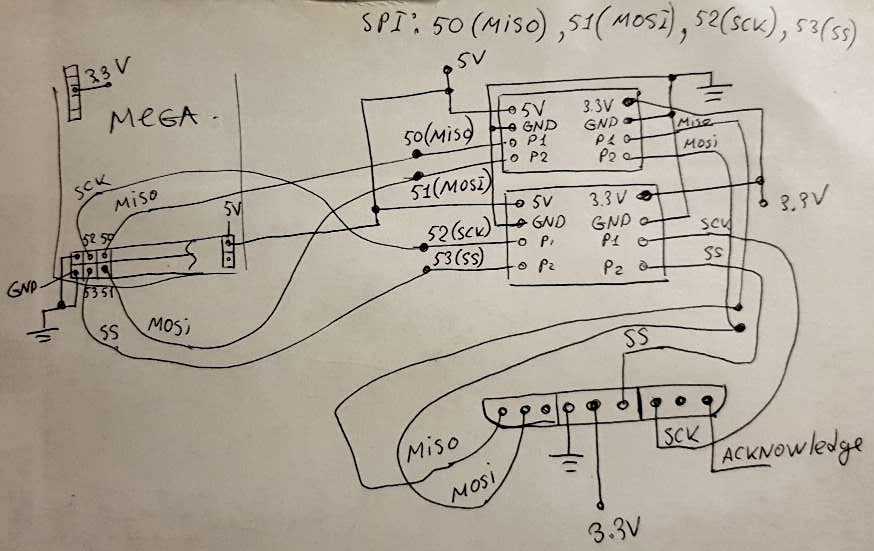
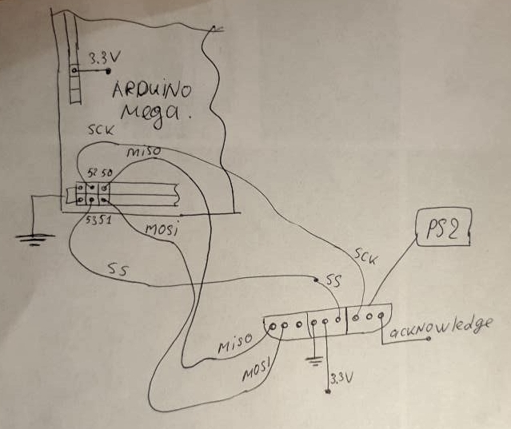
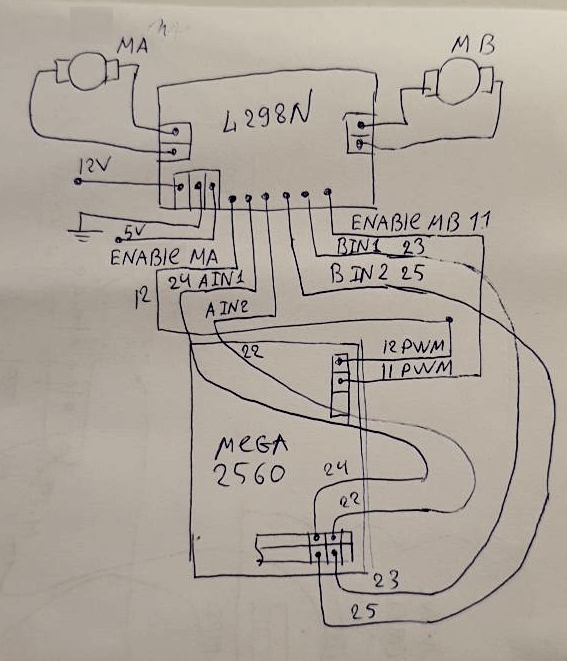
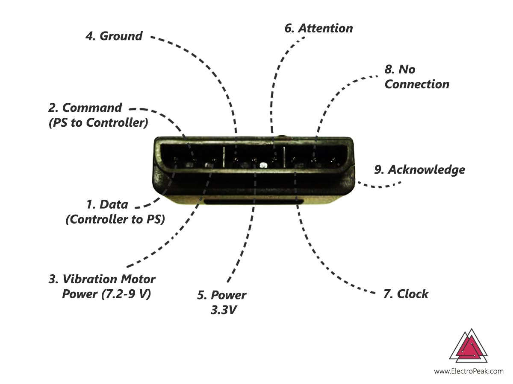
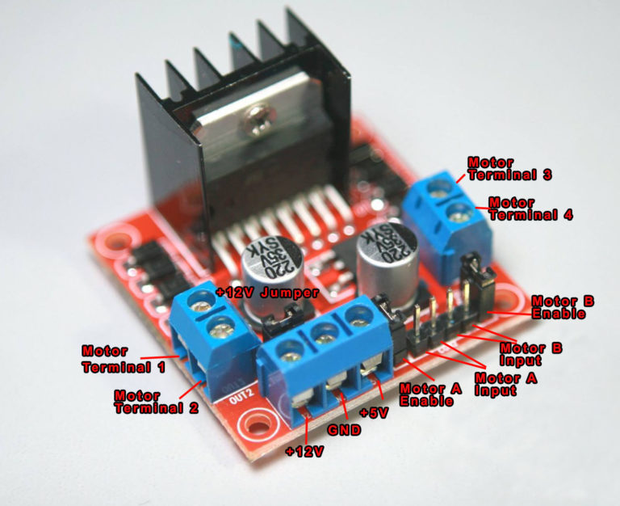

# Робот охранник 1.0

## Задачи этапа 1:

1. Освоить возможности платформы arduino на базе [Arduino Mega 2560](https://store.arduino.cc/usa/mega-2560-r3)
2. Освоить работу с  [L298N](https://www.teachmemicro.com/use-l298n-motor-driver/)
3. Освоить работу с  без проводным [PS2](https://create.arduino.cc/projecthub/electropeak/how-to-interface-ps2-wireless-controller-w-arduino-a0a813?f=1) контролером
4. Соединить все компоненты вместе, на базе [робо-платформы](https://ru.aliexpress.com/item/32621177415.html?spm=a2g0s.9042311.0.0.274233edJqk35b)
5. Создать программу управления роботом с пульта

Схема выводов arduino mega 2560:  


### Текущие трудности:

* Arduino Mega 2560 работает на 5V логике, a [PS2](https://ru.aliexpress.com/item/32857305986.html?spm=a2g0s.9042311.0.0.274233edyBKrYJ) контроллер на 3.3V,   и т.к логика не совместима и при непосредственном подключении PS2 к Mega 2560 может что то сгореть. Нужно использовать конвертер уровней например [вот такой](https://learn.sparkfun.com/tutorials/retired---using-the-logic-level-converter) на 4 канала, как раз на сигналы: MOSI MISO CLK SS, по следующей схеме:    



* Оказалось что можно подключить приёмник ps2 к Arduino Mega 2560 без конвертора напряжений, с конвертором не пошло, возможно плохо распаял конвертеры уровней, текущая схема подключения следующая:



Есть тонкий момент, что бы джостик спарился с приёмником, ждостик нужно включить **до подачи питания на приёмник.**

### Сейчас работоспособность джостика можно проверить вот этим кодом:

нужно установить библиотеку [PS2X\_lib](https://github.com/madsci1016/Arduino-PS2X/tree/master/PS2X_lib)

```text
#include <PS2X_lib.h>  //for v1.6

/******************************************************************
 * set pins connected to PS2 controller:
 *   - 1e column: original 
 *   - 2e colmun: Stef?
 * replace pin numbers by the ones you use
 ******************************************************************/
#define PS2_DAT        50  //14    
#define PS2_CMD        51  //15
#define PS2_SEL        53  //16
#define PS2_CLK        52  //17

/******************************************************************
 * select modes of PS2 controller:
 *   - pressures = analog reading of push-butttons 
 *   - rumble    = motor rumbling
 * uncomment 1 of the lines for each mode selection
 ******************************************************************/
//#define pressures   true
#define pressures   false
//#define rumble      true
#define rumble      false

PS2X ps2x; // create PS2 Controller Class

//right now, the library does NOT support hot pluggable controllers, meaning 
//you must always either restart your Arduino after you connect the controller, 
//or call config_gamepad(pins) again after connecting the controller.

int error = 0;
byte type = 0;
byte vibrate = 0;

void setup(){

  Serial.begin(57600);

  delay(300);  //added delay to give wireless ps2 module some time to startup, before configuring it

  //CHANGES for v1.6 HERE!!! **************PAY ATTENTION*************

  //setup pins and settings: GamePad(clock, command, attention, data, Pressures?, Rumble?) check for error
  error = ps2x.config_gamepad(PS2_CLK, PS2_CMD, PS2_SEL, PS2_DAT, pressures, rumble);

  if(error == 0){
    Serial.print("Found Controller, configured successful ");
    Serial.print("pressures = ");
    if (pressures)
      Serial.println("true ");
    else
      Serial.println("false");
    Serial.print("rumble = ");
    if (rumble)
      Serial.println("true)");
    else
      Serial.println("false");
    Serial.println("Try out all the buttons, X will vibrate the controller, faster as you press harder;");
    Serial.println("holding L1 or R1 will print out the analog stick values.");
    Serial.println("Note: Go to www.billporter.info for updates and to report bugs.");
  }  
  else if(error == 1)
    Serial.println("No controller found, check wiring, see readme.txt to enable debug. visit www.billporter.info for troubleshooting tips");

  else if(error == 2)
    Serial.println("Controller found but not accepting commands. see readme.txt to enable debug. Visit www.billporter.info for troubleshooting tips");

  else if(error == 3)
    Serial.println("Controller refusing to enter Pressures mode, may not support it. ");

//  Serial.print(ps2x.Analog(1), HEX);

  type = ps2x.readType(); 
  switch(type) {
    case 0:
      Serial.print("Unknown Controller type found ");
      break;
    case 1:
      Serial.print("DualShock Controller found ");
      break;
    case 2:
      Serial.print("GuitarHero Controller found ");
      break;
    case 3:
      Serial.print("Wireless Sony DualShock Controller found ");
      break;
   }
}

void loop() {
  /* You must Read Gamepad to get new values and set vibration values
     ps2x.read_gamepad(small motor on/off, larger motor strenght from 0-255)
     if you don't enable the rumble, use ps2x.read_gamepad(); with no values
     You should call this at least once a second
   */  
  if(error == 1) //skip loop if no controller found
    return; 

  if(type == 2){ //Guitar Hero Controller
    ps2x.read_gamepad();          //read controller 

    if(ps2x.ButtonPressed(GREEN_FRET))
      Serial.println("Green Fret Pressed");
    if(ps2x.ButtonPressed(RED_FRET))
      Serial.println("Red Fret Pressed");
    if(ps2x.ButtonPressed(YELLOW_FRET))
      Serial.println("Yellow Fret Pressed");
    if(ps2x.ButtonPressed(BLUE_FRET))
      Serial.println("Blue Fret Pressed");
    if(ps2x.ButtonPressed(ORANGE_FRET))
      Serial.println("Orange Fret Pressed"); 

    if(ps2x.ButtonPressed(STAR_POWER))
      Serial.println("Star Power Command");

    if(ps2x.Button(UP_STRUM))          //will be TRUE as long as button is pressed
      Serial.println("Up Strum");
    if(ps2x.Button(DOWN_STRUM))
      Serial.println("DOWN Strum");

    if(ps2x.Button(PSB_START))         //will be TRUE as long as button is pressed
      Serial.println("Start is being held");
    if(ps2x.Button(PSB_SELECT))
      Serial.println("Select is being held");

    if(ps2x.Button(ORANGE_FRET)) {     // print stick value IF TRUE
      Serial.print("Wammy Bar Position:");
      Serial.println(ps2x.Analog(WHAMMY_BAR), DEC); 
    } 
  }
  else { //DualShock Controller
    ps2x.read_gamepad(false, vibrate); //read controller and set large motor to spin at 'vibrate' speed

    if(ps2x.Button(PSB_START))         //will be TRUE as long as button is pressed
      Serial.println("Start is being held");
    if(ps2x.Button(PSB_SELECT))
      Serial.println("Select is being held");      

    if(ps2x.Button(PSB_PAD_UP)) {      //will be TRUE as long as button is pressed
      Serial.print("Up held this hard: ");
      Serial.println(ps2x.Analog(PSAB_PAD_UP), DEC);
    }
    if(ps2x.Button(PSB_PAD_RIGHT)){
      Serial.print("Right held this hard: ");
      Serial.println(ps2x.Analog(PSAB_PAD_RIGHT), DEC);
    }
    if(ps2x.Button(PSB_PAD_LEFT)){
      Serial.print("LEFT held this hard: ");
      Serial.println(ps2x.Analog(PSAB_PAD_LEFT), DEC);
    }
    if(ps2x.Button(PSB_PAD_DOWN)){
      Serial.print("DOWN held this hard: ");
      Serial.println(ps2x.Analog(PSAB_PAD_DOWN), DEC);
    }   

    vibrate = ps2x.Analog(PSAB_CROSS);  //this will set the large motor vibrate speed based on how hard you press the blue (X) button
    byte pss_rx = ps2x.Analog(PSS_RX);  //this will set the large motor vibrate speed based on how hard you press the blue (X) button
    byte pss_ry = ps2x.Analog(PSS_RY);  //this will set the large motor vibrate speed based on how hard you press the blue (X) button

    byte pss_lx = ps2x.Analog(PSS_LX);  //this will set the large motor vibrate speed based on how hard you press the blue (X) button
    byte pss_ly = ps2x.Analog(PSS_LY);  //this will set the large motor vibrate speed based on how hard you press the blue (X) button

    Serial.print("rx: "); Serial.print(pss_rx);
    Serial.print(" ry: "); Serial.print(pss_ry);
    Serial.print(" lx: "); Serial.print(pss_lx);
    Serial.print(" ly: "); Serial.println(pss_ly);


    if (ps2x.NewButtonState()) {        //will be TRUE if any button changes state (on to off, or off to on)
      if(ps2x.Button(PSB_L3))
        Serial.println("L3 pressed");
      if(ps2x.Button(PSB_R3))
        Serial.println("R3 pressed");
      if(ps2x.Button(PSB_L2))
        Serial.println("L2 pressed");
      if(ps2x.Button(PSB_R2))
        Serial.println("R2 pressed");
      if(ps2x.Button(PSB_TRIANGLE))
        Serial.println("Triangle pressed");        
    }

    if(ps2x.ButtonPressed(PSB_CIRCLE))               //will be TRUE if button was JUST pressed
      Serial.println("Circle just pressed");
    if(ps2x.NewButtonState(PSB_CROSS))               //will be TRUE if button was JUST pressed OR released
      Serial.println("X just changed");
    if(ps2x.ButtonReleased(PSB_SQUARE))              //will be TRUE if button was JUST released
      Serial.println("Square just released");     

    if(ps2x.Button(PSB_L1) || ps2x.Button(PSB_R1)) { //print stick values if either is TRUE
      Serial.print("Stick Values:");
      Serial.print(ps2x.Analog(PSS_LY), DEC); //Left stick, Y axis. Other options: LX, RY, RX  
      Serial.print(",");
      Serial.print(ps2x.Analog(PSS_LX), DEC); 
      Serial.print(",");
      Serial.print(ps2x.Analog(PSS_RY), DEC); 
      Serial.print(",");
      Serial.println(ps2x.Analog(PSS_RX), DEC); 
    }     
  }
  delay(50);  
}
```

## Подключение моторов к драйверу и к arduino:



Данный скетч отлично работает:

```text
#define EnA 12
#define EnB 11
#define In1 24
#define In2 22
#define In3 25
#define In4 23


void setup()
{
  // All motor control pins are outputs
  pinMode(EnA, OUTPUT);
  pinMode(EnB, OUTPUT);
  pinMode(In1, OUTPUT);
  pinMode(In2, OUTPUT);
  pinMode(In3, OUTPUT);
  pinMode(In4, OUTPUT);
}
void goStraight()   //run both motors in the same direction
{
  // turn on motor A
  digitalWrite(In1, LOW);
  digitalWrite(In2, HIGH);
  // set speed to 150 out 255
  analogWrite(EnA, 100);

  //return;
  // turn on motor B
  digitalWrite(In3, HIGH);
  digitalWrite(In4, LOW);
  // set speed to 150 out 255
  analogWrite(EnB, 100);

  delay(2000);
  // now turn off motors
  digitalWrite(In1, LOW);
  digitalWrite(In2, LOW);  
  digitalWrite(In3, LOW);
  digitalWrite(In4, LOW);
}
void loop()
{
  goStraight();
  delay(1000);
}
```



## Теперь сделаем управление машиной через пульт, Андрей тебе слово...:

## Основные материалы:






## Репозиторий проекта этапа 1, [тут ](https://github.com/AlexLexx706/mega_car/blob/master/mega_nrf_nano.ino)


