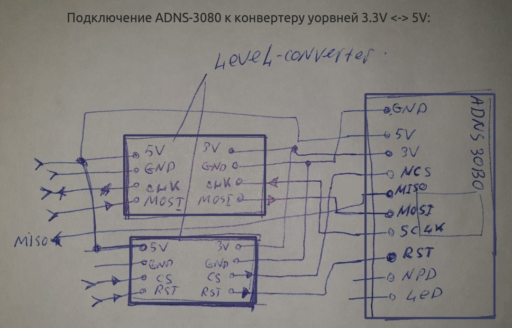
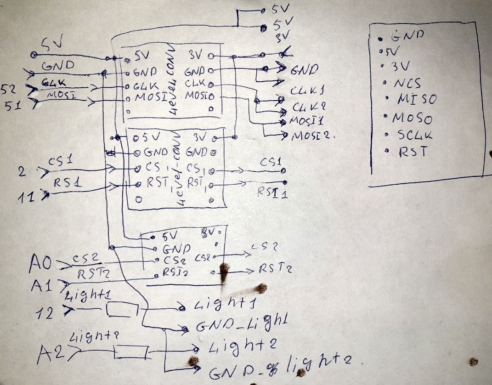
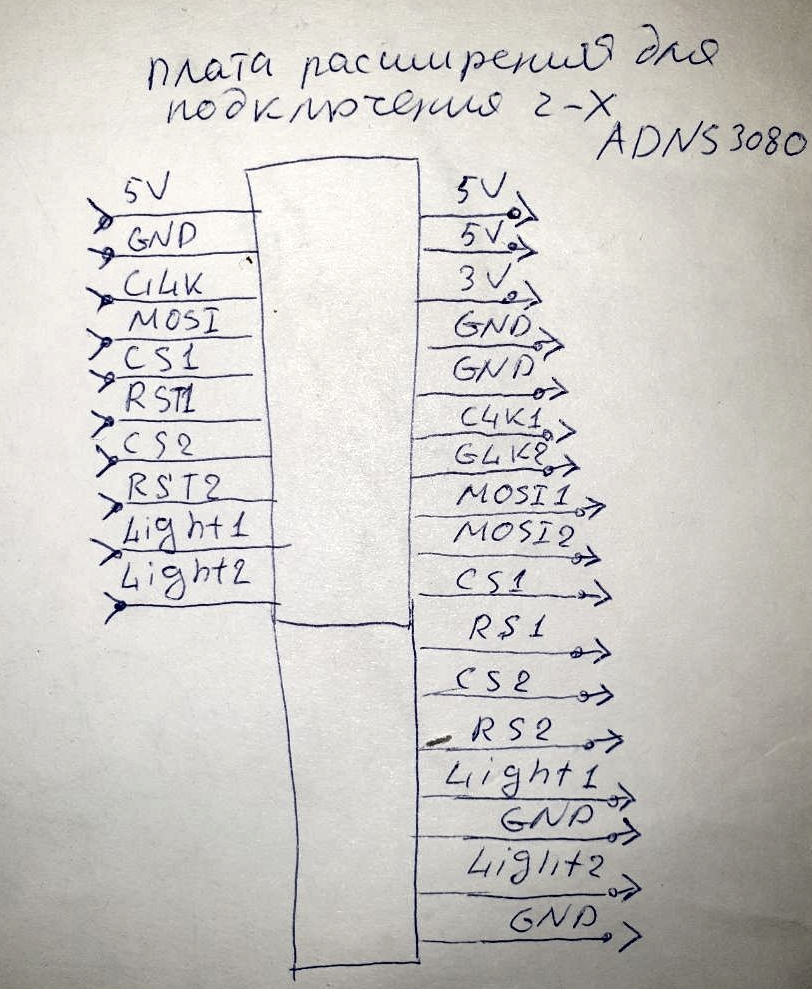
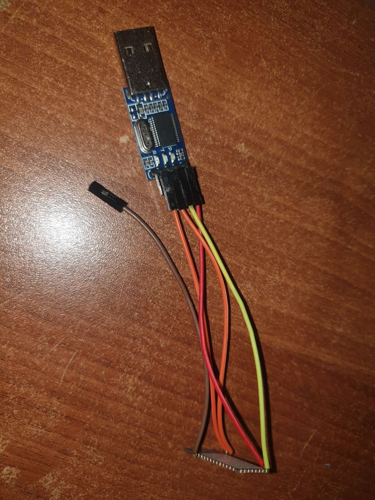
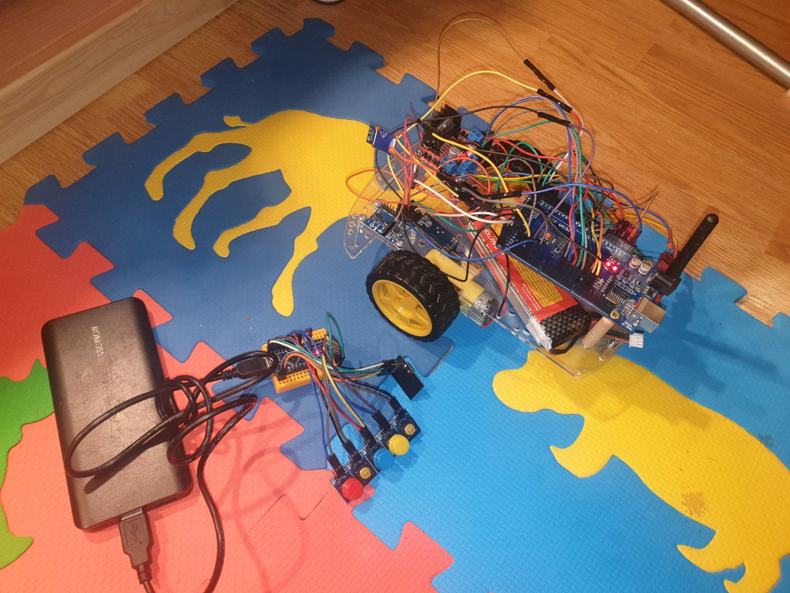
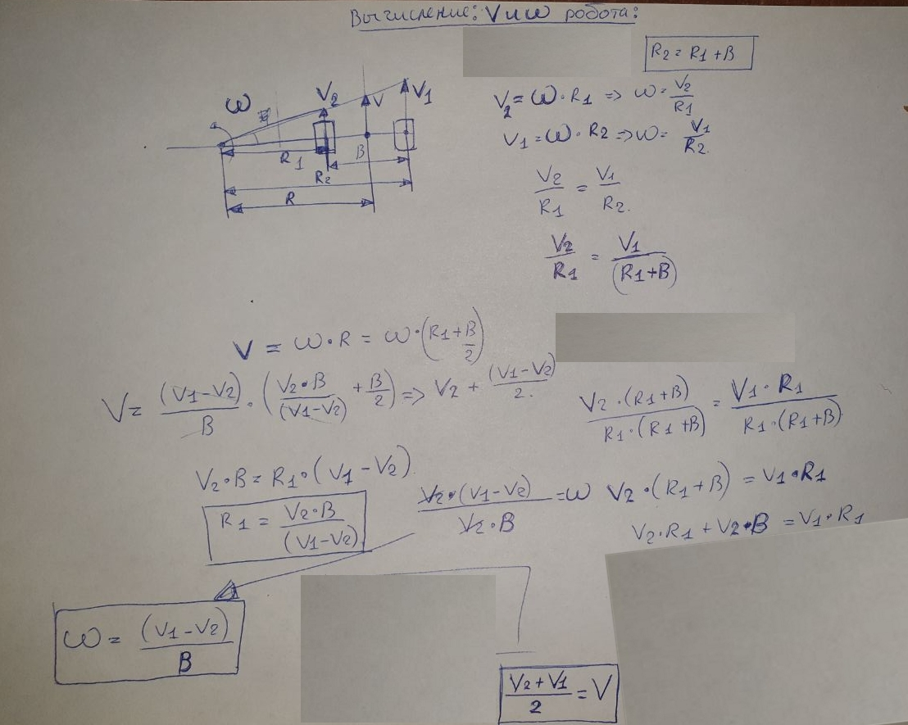
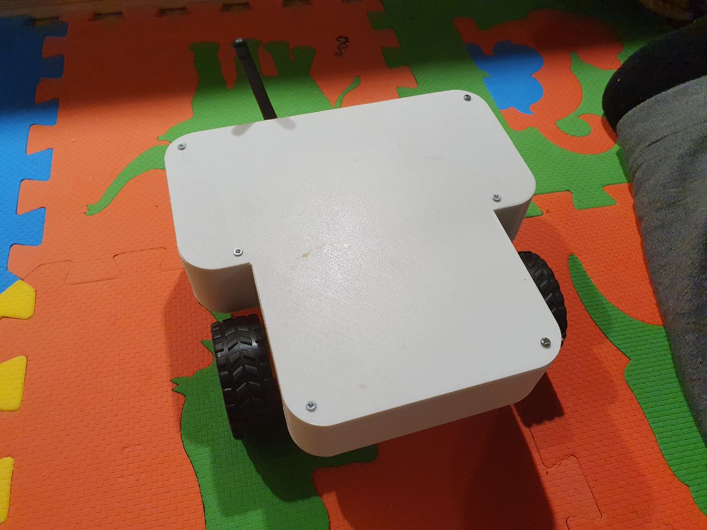
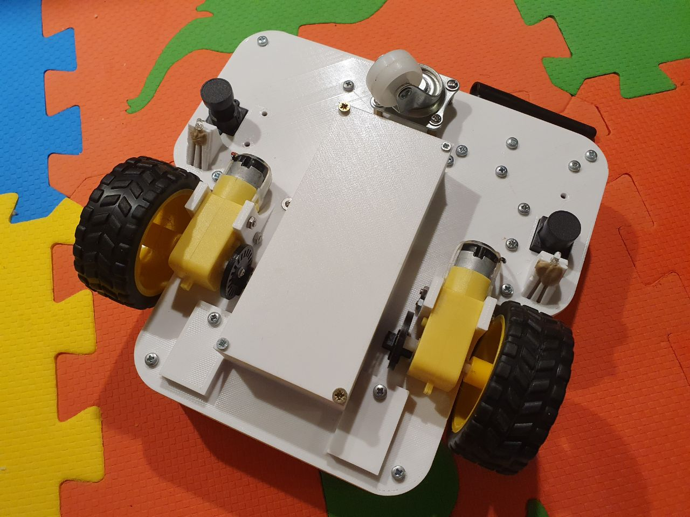

# Этап 1.1

* После первых испытаний с пультом [китайского аналога PS2](https://aliexpress.ru/item/32857305986.html?spm=a2g0s.9042311.0.0.264d33edewPG74&_ga=2.150436022.1072583910.1607177262-750059769.1578514621&sku_id=65286515313):  


стало ясно, что эта штука **плохо обеспечивает** стабильную связь. Было принято решение реализовать свой собственный [пульт управления и базе модуля NRF24L01](https://app.gitbook.com/@alexlexx1/s/guard_bot/pult-upravleniya) и ответной части приёмника в роботе:  


* Так же за одно с новой связью захотелось попробовать [ADNS-3080](https://www.openimpulse.com/blog/wp-content/uploads/wpsc/downloadables/ADNS-3080.pdf):  


Пример работы с данным сенсором был взят [тут](https://github.com/Lauszus/ADNS3080/blob/master/ADNS3080.ino)

Информация о подключении и некоторая математика [тут](https://ardupilot.org/copter/docs/common-mouse-based-optical-flow-sensor-adns3080.html)

[Datasheet](http://www.kontest.ru/datasheet/AVAG0TECHN0L0GIES/ADNS-3080.pdf) 

На страничке магаза, то же что то написано, [тут](https://aliexpress.ru/item/4000273493900.html?spm=a2g0o.productlist.0.0.4afb4648Zs6vRB&algo_pvid=cc40735a-eeab-40d8-819b-42b8907156dc&algo_expid=cc40735a-eeab-40d8-819b-42b8907156dc-17&btsid=0b8b036316075077829264991e999a&ws_ab_test=searchweb0_0,searchweb201602_,searchweb201603_&sku_id=10000001112053354)

Схема подключения ADNS-3080 к конвертеру уровней для совместимости с atmega:

конвертер уровней на [4 канала](https://www.addicore.com/Logic-Level-Converter-Bi-Directional-5V-to-3-3V-p/227.htm)

CS pin = 2

RST pin = 11

### Подключение одного ADNS3080 к ардуино:



### Подключение двух ADNS3080 к ардуино через плату расширения:

 



### Выходы платы расширения: 

 



* Для движения по прямой было принято решение использовать гироскоп L3GD20:  


Пример подключения и получения данных с данного устройства [тут](https://github.com/pololu/l3g-arduino), пример подключения датчика к arduin uno [тут](https://www.compel.ru/item-pdf/20dfd604e5bb0086f7847de4f2e71196/pn/adafruit~l3gd20h-triple-axis-gyro-breakout-board---l3gd20-l3g4200.pdf)

### Принципиальная схема устройства: 

 


### Подключение одометрии:

 


описание входов есть [тут](https://freedelivery.com.ua/arduino-100/datchiki-130/datchik-skorosti-vraschenija-taxometr-f249-fc-03-modul-arduino-avr-pic.html)

Цифровые ноги подключил к портам 18 и 19, подсчёт тиков по прерыванию.

Скетчь для подсчёта тиков:

```text
int encoder_left_pin = 18; // импульсные сигналы от модуля
int encoder_right_pin = 19; // импульсные сигналы от модуля

volatile byte pulses_left, pulses_right; // количество импульсов
unsigned long timeold;

void counter_left() {
	//обновление счета импульсов
	pulses_left++;
}

void counter_right() {
	//обновление счета импульсов
	pulses_right++;
}

void setup()
{
	Serial.begin(9600);
	Serial2.begin(9600);
	pinMode(encoder_left_pin, INPUT);
	pinMode(encoder_right_pin, INPUT);
	//Прерывание 0 на цифровой линии 2
	//Срабатывание триггера по спаду сигнала
	attachInterrupt(digitalPinToInterrupt(encoder_left_pin), counter_left, FALLING);
	attachInterrupt(digitalPinToInterrupt(encoder_right_pin), counter_right, FALLING);
	// Инициализация
	pulses_left = 0;
	pulses_right = 0;
	timeold = millis();
}
void loop()
{

	unsigned long cur_time = millis();	
	if (cur_time - timeold >= 100) {
		//Не обрабатывать прерывания во время счёта
		detachInterrupt(digitalPinToInterrupt(encoder_left_pin));
		byte cur_pulses_left = pulses_left;
		pulses_left = 0;
		attachInterrupt(digitalPinToInterrupt(encoder_left_pin), counter_left, FALLING);

		detachInterrupt(digitalPinToInterrupt(encoder_right_pin));
		byte cur_pulses_right = pulses_right;
		pulses_right = 0;
		attachInterrupt(digitalPinToInterrupt(encoder_right_pin), counter_right, FALLING);
		timeold = cur_time;
		Serial.print("left: ");
		Serial.print(cur_pulses_left, DEC);
		Serial.print(" right: ");
		Serial.println(cur_pulses_right, DEC);

		Serial2.print("left: ");
		Serial2.print(cur_pulses_left, DEC);
		Serial2.print(" right: ");
		Serial2.println(cur_pulses_right, DEC);
		//Перезагрузка процесса обработки прерываний
	}
}
```


### Подключение Bluetooth модуля к PC linux для отладки: 

 



 


 


* Могуль отказался подключаться через GUI ubuntu
* подключил модуль через usb-uart, включил режим AT \(подал 3.3V на порт mode\), настроил boad-rate, pin, name: список комманда в конце статьи [тут](https://www.instructables.com/AT-command-mode-of-HC-05-Bluetooth-module/)
* Нашол инструкцию как подключить BT через теримал [тут](https://askubuntu.com/questions/248817/how-to-i-connect-a-raw-serial-terminal-to-a-bluetooth-connection): 
  * ```text
    #interactive bluetooth control tool:

    sudo bluetoothctl
    power on
    agent on
    scan on    #show mac and dev-name
    pair <MAC>

    # link bt to tty
    sudo killall rfcomm
    sudo rfcomm connect /dev/rfcomm0 <MAC> 1 &
    ```
* BT подключил к uart2 в arduino mega 2560 питание с 3.3 v, не стал делать делитель напряжения для входа RX на BT \(пока работает\), но точно нужно сделать иначе сгорит.
* Скетч проверки работы через serial2:

```text
void setup() {
  Serial2.begin(115200);
  Serial2.println("Hello Serial 2");
}
static int i = 0;

void loop() {
  Serial2.print("i:");
  Serial2.println(i++);
}
```

### Пока всё это выглядит так:

 



## Сбор данных одометрии и обработка:

* Для удалённой сборки данных одометрии используеться BT модуль
* в BT пишутся: 
  * значение скорости по одометрам, отсчёты/период
  * величина угловой скорости, град./сек.
  * величина heading, град.
* Для рассчёта позиции по одометрии примем следующую модель:  



* Количество испульсов на оборот 20
* период дискретизации скорости 10 Гц
* диаметр колеса робота 0.065 м

## Тестовые данные:

Первые тестовые данные [тут](https://github.com/AlexLexx706/guard_bot_firmware/tree/master/logs)

## Пошивка:

Репозиторий с последней прошивкой [тут](https://github.com/AlexLexx706/guard_bot_firmware):

## Модель корпуса:

последняя ревизия корпуса [тут](https://cad.onshape.com/documents/f32f16fee08bb404acc67ec5/w/15b2490949f70b6df45c59d8/e/792526e4e09f04ff690c8e5a)

## Результаты сборки:

 



 






