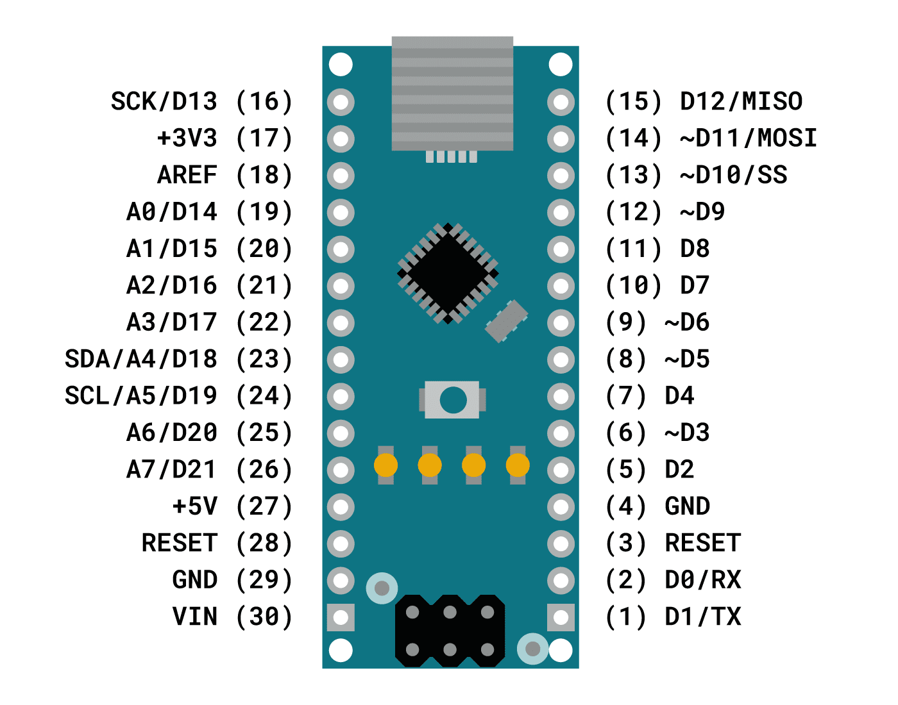
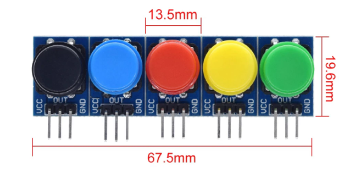
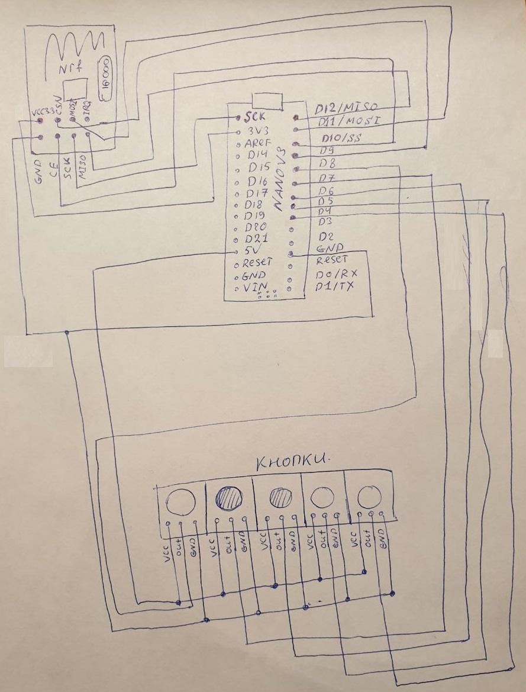

# Пульт управления

### Основные компаненты пульта управления:

* arduino nano:  

* NRF24L01:  

Кнопки:  

### Сборка на макетной плате:

 

### Принципиальная схема:

 

### Прошивка:

Цели прошивки:

* Организовать работу с модулем NRF24L01
* Сделать процедуру опроса состояния кнопок
* Сделать процедуру обработки дребезга контактов
* Реализовать протокол управления роботом охранником

Тукущая прошивка [тут](https://github.com/AlexLexx706/nano_pult)

