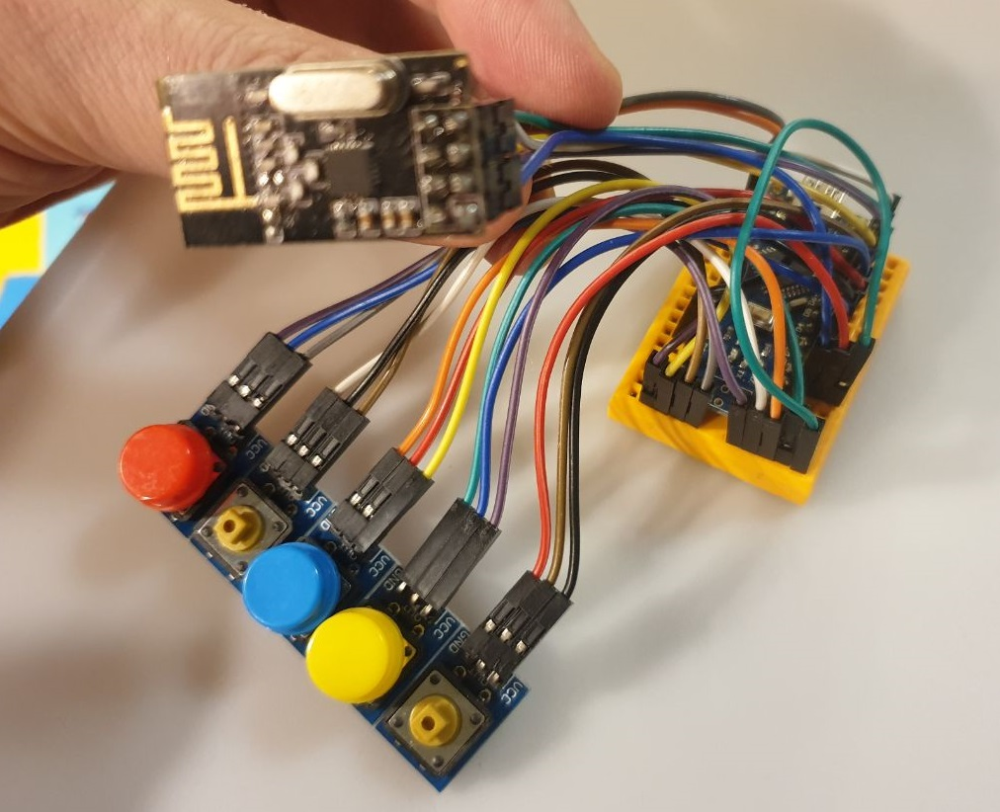
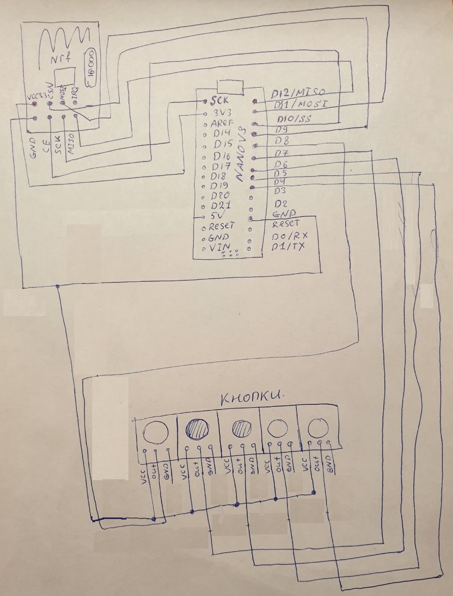

# Пульт управления машиной:

### Основные компаненты пульта управления:

* [arduino nano](https://www.circuitstoday.com/arduino-nano-tutorial-pinout-schematics):  

* [NRF24L01](https://components101.com/wireless/nrf24l01-pinout-features-datasheet):  

[Кнопки](https://aliexpress.ru/item/32824262751.html?spm=a2g0o.productlist.0.0.4ab26d4bgvBRJF&algo_pvid=178494f7-36d6-436c-b4a7-c5701d6b614e&algo_expid=178494f7-36d6-436c-b4a7-c5701d6b614e-1&btsid=0b8b034516072114807911590e5d52&ws_ab_test=searchweb0_0,searchweb201602_,searchweb201603_&sku_id=64911014006):  

### Сборка пульта на макетной плате:

 

### Принципиальная схема:

  

### Задачи прошивки arduino Nano:

* Организовать работу с модулем NRF24L01
* Сделать процедуру опроса состояния кнопок
* Сделать процедуру обработки дребезга контактов
* Реализовать протокол управления роботом охранником

### Протокол управления:

По радио каналу передаются байты управления, при удержании кнопок в нажатом состоянии \(5 кнопок\) передаются символы из набора: **"wsad "** с заданным периодом.

Тукущая прошивка [тут](https://github.com/AlexLexx706/nano_pult)

### Первая сборка из "гип": 



